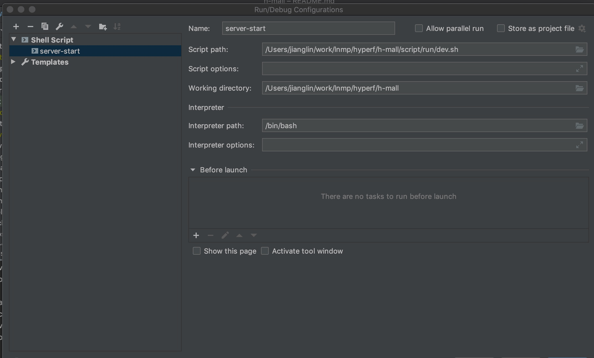

# 介绍，项目开发中

多商户商城系统

### 开发环境

建议使用docker部署开发环境，如果开发环境部署成功，启动服务如下：

> 容器内部启动服务

```shell script
# 进入容器手动启动服务
$ docker exec -it dhyperf bash
# 进入容器，再进入项目目录
$ cd /hyperf-skeleton/h-mall 
# 删除代理类并启动服务
$ rm -rf runtime/container && php ./bin/hyperf.php start
# 同上一样的效果，但是注意composer超时时间
$ composer start-dev

```

> phpstorm 配置脚本启动，不需要进入容器

1. 创建shell script脚本
2. 配置`Script path:`路径，项目根目录`script/run/dev.sh`，保存配置
3. 点击上面绿色按钮启动服务

配置示例：



