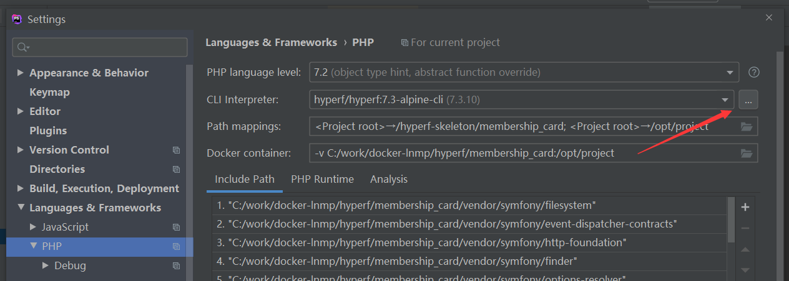
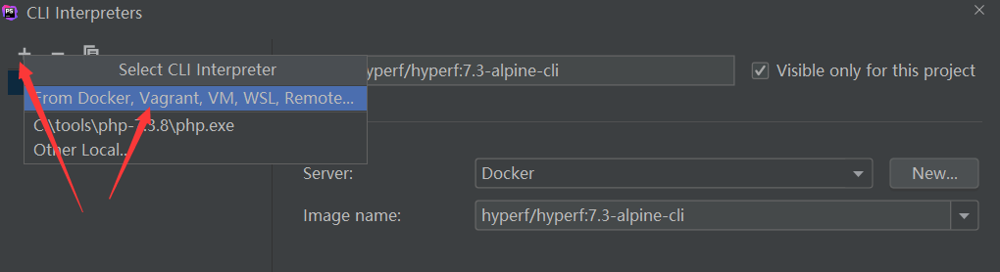
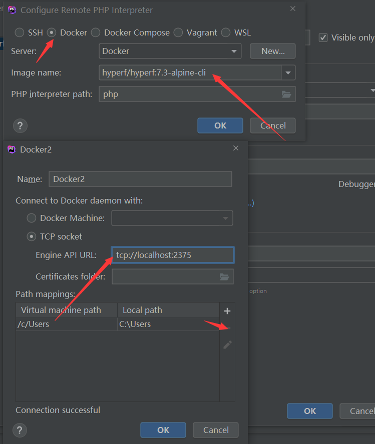
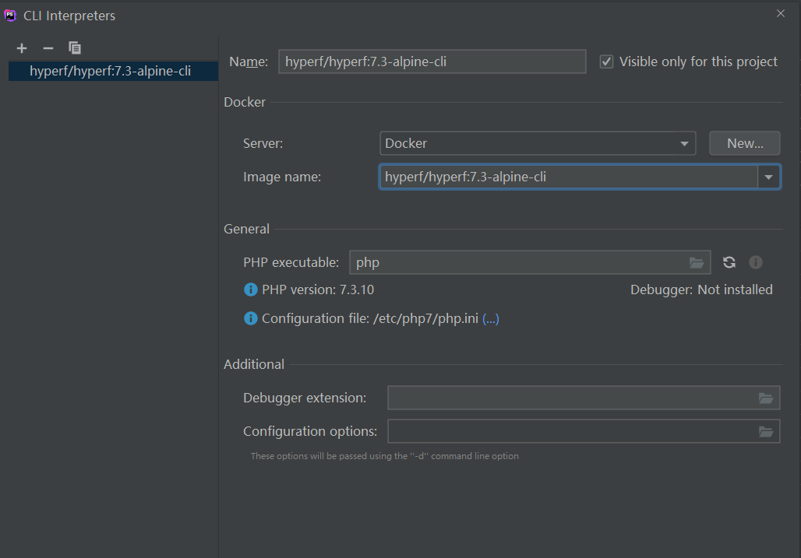
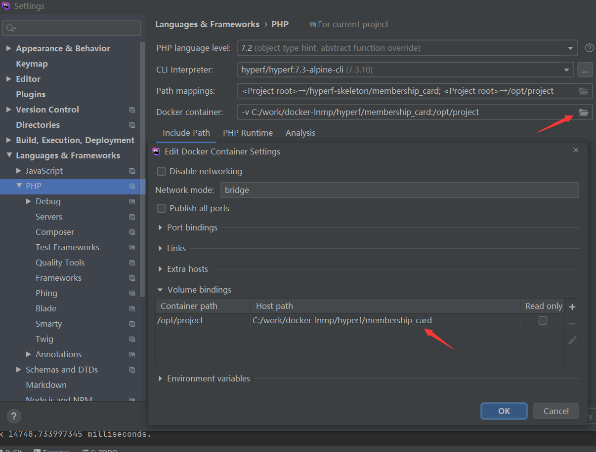
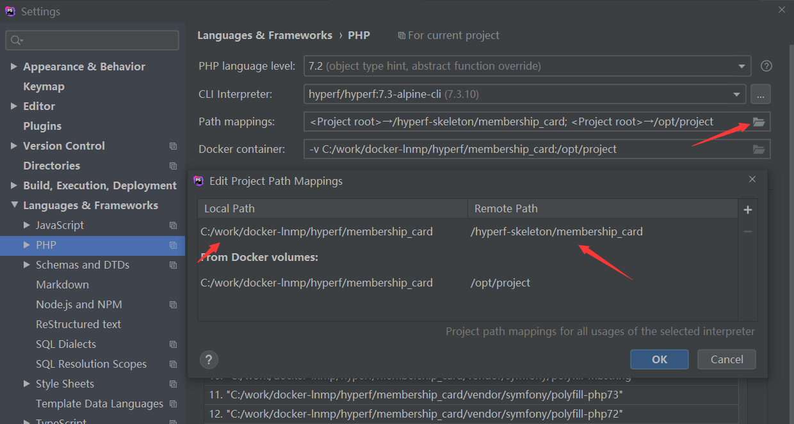
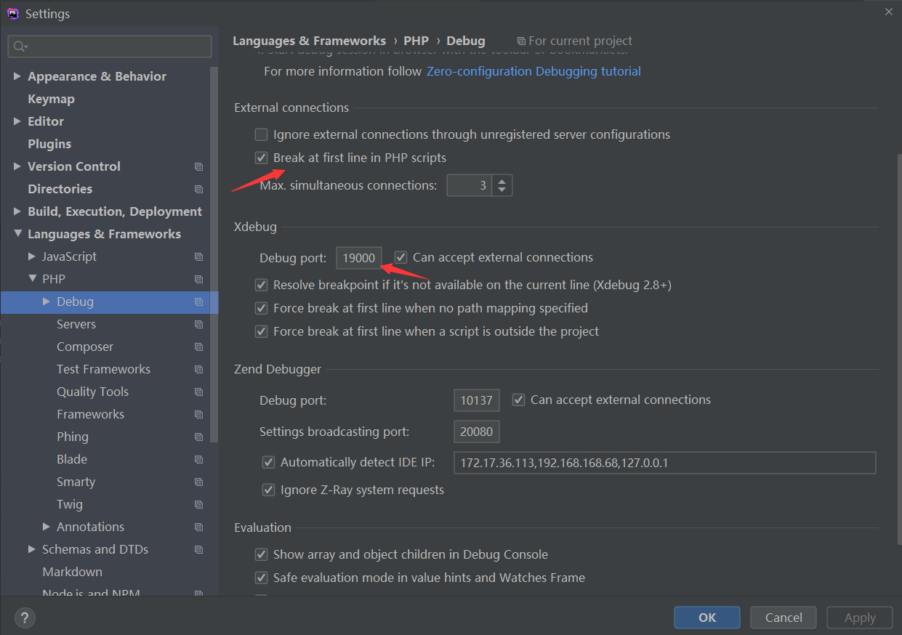
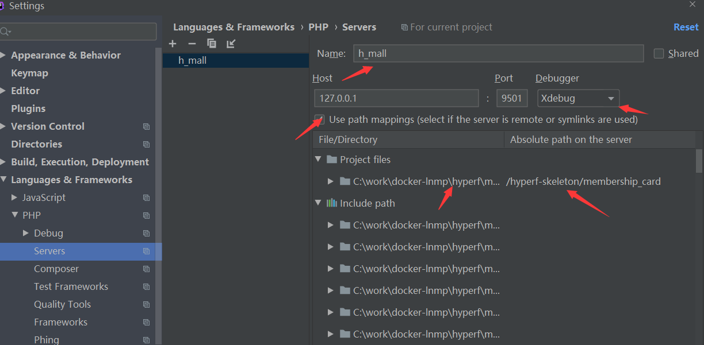
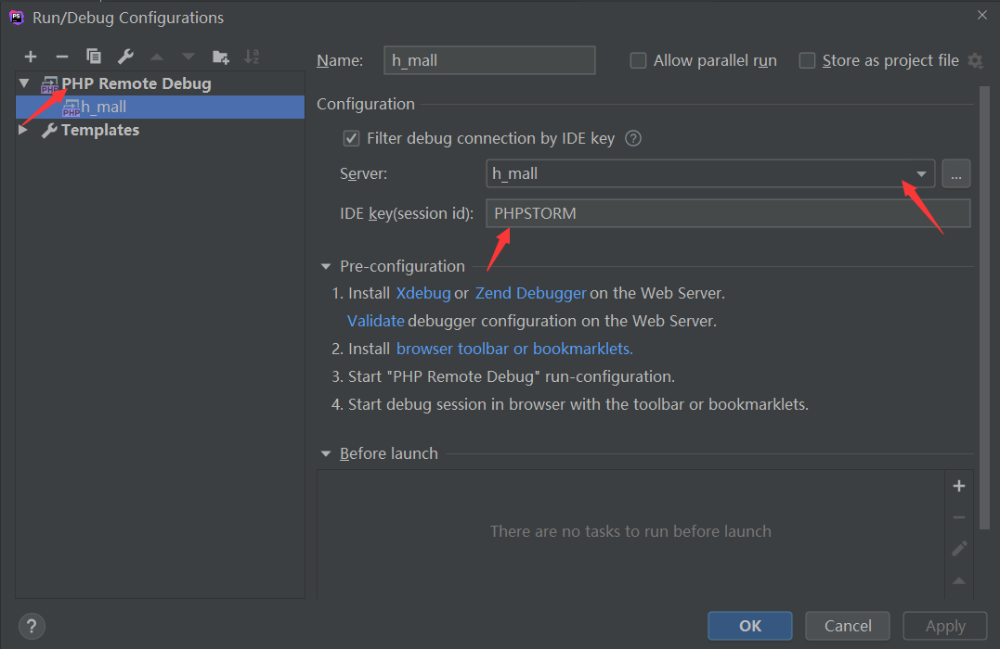
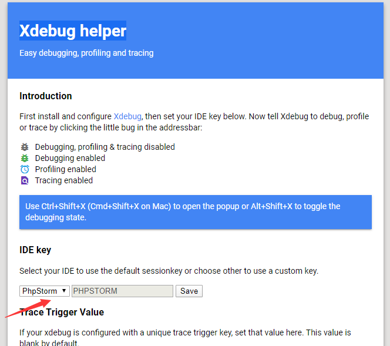

### 配置 hyperf + docker + xdebug

[帮助](https://segmentfault.com/a/1190000022542444?utm_source=tag-newest)

> xdebug 配置

```shell script
# 克隆项目
$ git clone git@github.com:mabu233/sdebug.git

# 进入容器
$ docker exec -it dhyperf bash
$ cd /hyperf-skeleton/sdebug
$ chmod +x rebuild.sh

# 设置alpine源
$ sed -i 's/dl-cdn.alpinelinux.org/mirrors.aliyun.com/g' /etc/apk/repositories

# 安装linux基础命令
$ apk add --update util-linux vim

# 安装phpize,php-config
$ apk add phpize_devs php7-dev
$ ln -s /usr/bin/phpize7 /usr/bin/phpize
$ ln -s /usr/bin/php-config7 /usr/bin/php-config
$ ./rebuild.sh

# 配置php.ini
$ vim /etc/php7/php.ini
zend_extension="xdebug.so"
xdebug.remote_enable=1
xdebug.remote_autostart=1
xdebug.remote_host=host.docker.internal
xdebug.remote_port=19000
xdebug.idekey=PHPSTORM

# 查看phpinfo信息
$ php -v
PHP 7.3.10 (cli) (built: Oct 10 2019 21:36:56) ( NTS )
Copyright (c) 1997-2018 The PHP Group
Zend Engine v3.3.10, Copyright (c) 1998-2018 Zend Technologies
    with Sdebug v2.7.3-dev, Copyright (c) 2002-2019, by Derick Rethans
```

> PHPSTROM 配置

1. 配置cli








2. 配置debug



3. 配置servers



4. 配置启动脚本



5. 启动debug会报错, 需要进入容器执行如下命令

```shell script
$ export PHP_IDE_CONFIG=serverName=h_mall
```

6. chrome `Xdebug helper` 选择phpstorm

